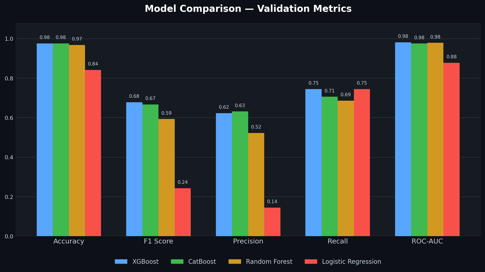
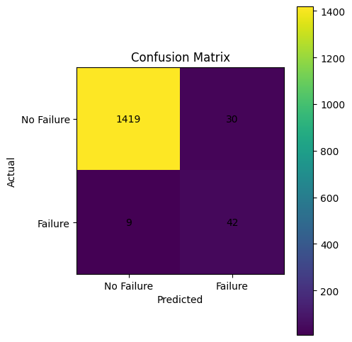

<div align="center">

# ⚙️ Automated Predictive Maintenance System

### End-to-End Machine Failure Prediction with a Production-Grade MLOps Pipeline

[](https://www.python.org/)
[](https://flask.palletsprojects.com/)
[](https://www.docker.com/)
[](https://aws.amazon.com/)
[](https://mlflow.org/)
[](https://dvc.org/)

[](#)
[](LICENSE)
[](#)
<!-- Repo-specific badges — replace <user>/<repo> once pushed -->
[](#)
[](#)
[](#)

*A complete, modular, industry-style ML system that predicts machine failure from sensor data — built from raw data ingestion all the way through to a CI/CD-deployed, containerized Flask application on AWS.*

</div>

---

## 📌 Table of Contents

- [Problem Statement](#-problem-statement)
- [Dataset](#-dataset)
- [Overview](#-overview)
- [Live Demo / Screenshot](#-live-demo--screenshot)
- [Architecture](#-architecture)
- [Project Structure](#-project-structure)
- [Tech Stack](#-tech-stack)
- [ML Pipeline Walkthrough](#-ml-pipeline-walkthrough)
- [Key Design Decisions](#-key-design-decisions)
- [Model Comparison](#-model-comparison)
- [Final Evaluation (Unseen Test Set)](#-final-evaluation-unseen-test-set)
- [MLOps & Deployment](#-mlops--deployment)
- [CI/CD Pipeline](#-cicd-pipeline)
- [Getting Started](#-getting-started)
- [Environment Variables](#-environment-variables)
- [Limitations & Honest Tradeoffs](#-limitations--honest-tradeoffs)
- [Future Improvements](#-future-improvements)
- [Author](#-author)

---

## 🎯 Problem Statement

Unplanned machine downtime is one of the most expensive problems in manufacturing — every hour a production line is unexpectedly offline costs money, missed orders, and emergency repair premiums. Most plants still run on either **reactive maintenance** (fix it after it breaks) or **scheduled maintenance** (replace parts on a fixed calendar, whether they need it or not — wasteful in either direction).

**Predictive maintenance** flips this: using live sensor readings (temperature, torque, rotational speed, tool wear) to predict *before* a failure happens, so maintenance can be scheduled exactly when needed — not too early, not too late.

This project builds that prediction system end-to-end: not just a model in a notebook, but a deployed, monitored, CI/CD-driven service that could plausibly sit in front of a real production line.

---

## 📊 Dataset

This project uses the **[AI4I 2020 Predictive Maintenance Dataset](https://archive.ics.uci.edu/dataset/601/ai4i+2020+predictive+maintenance+dataset)** (UCI Machine Learning Repository, CC BY 4.0), a synthetic-but-realistic dataset modeled on real industrial milling machine behavior.

| Property | Value |
|---|---|
| Rows | 10,000 |
| Features | 14 (incl. UID, Product ID, Type, Air Temp, Process Temp, Rotational Speed, Torque, Tool Wear) |
| Target | `Machine failure` (binary) |
| Overall failure rate | **3.4%** — severe class imbalance |
| Missing values | None — clean dataset |

The binary target is triggered by **5 independent failure modes**, any one of which sets `Machine failure = 1`:

| Mode | Description | Occurrences |
|---|---|---|
| **TWF** — Tool Wear Failure | Tool fails/replaced after a randomly assigned wear threshold | ~46–51 |
| **HDF** — Heat Dissipation Failure | Air/process temp difference < 8.6 K **and** rotational speed < 1380 rpm | 115 |
| **PWF** — Power Failure | Torque × rotational speed (power) falls outside 3500–9000 W | 95 |
| **OSF** — Overstrain Failure | Tool wear × torque exceeds a variant-specific threshold (11,000–13,000 min·Nm) | 98 |
| **RNF** — Random Failure | 0.1% random chance per process, independent of all parameters | ~5–19 |

This is exactly the kind of imbalance that breaks naive accuracy-driven modeling — a model predicting "no failure" every single time would already score ~96.6% accuracy while being completely useless. This single fact drives almost every modeling decision in this project (see [Key Design Decisions](#-key-design-decisions)).

> Note: the 5 failure-mode columns are available in the raw data but are **dropped before training** — they're a leakage risk since they directly determine the target. Only sensor-level features are used for prediction.

---

## 🔎 Overview

This project predicts **machine failure** using the dataset above, built as a fully modular, production-style MLOps pipeline rather than a notebook-only proof of concept.

Every stage — ingestion, validation, transformation, training, evaluation, and serving — is implemented as an independent, reusable component, orchestrated through a config-driven architecture (`config.yaml` / `schema.yaml` / `params.yaml`) and wired together with custom logging and exception handling throughout.

**Highlights:**
- 🏭 Modular `components → stages → pipeline` architecture (industry-style, not notebook-only)
- 🧪 4 models benchmarked with `RandomizedSearchCV`: Logistic Regression, Random Forest, XGBoost, CatBoost
- ⚖️ Built for **3.4% failure-rate class imbalance** — model selection driven by F1, not accuracy
- 📊 Full experiment tracking via **MLflow**, remote-hosted on **DagsHub**
- 🗃️ Data & artifact versioning with **DVC**
- 🐳 Dockerized app — optimized from **3.64 GB → 1.81 GB**
- 🔁 **CI/CD** via GitHub Actions on a **self-hosted runner**, deploying to **AWS EC2** through **ECR**
- ✅ Strict train/validation/test discipline — test set stayed completely untouched until final evaluation

---

## 🖥️ Live Demo / Screenshot

> *Add a screenshot or GIF of your Flask app here — this is the single highest-impact thing you can add to this README.*

```markdown

```

---

## 🏗️ Architecture

```
                 ┌──────────────┐
                 │   Kaggle API │
                 └──────┬───────┘
                        ▼
              ┌────────────────────┐
              │  Data Ingestion    │  ──▶ data/raw/
              └─────────┬──────────┘
                        ▼
              ┌────────────────────┐
              │  Data Validation   │  ──▶ artifacts/data_validation/status.txt
              │ (schema-driven)    │
              └─────────┬──────────┘
                        ▼
              ┌────────────────────┐
              │ Data Transformation│  ──▶ data/preprocessed/*.npy
              │ (Encode/Scale/SMOTE)│
              └─────────┬──────────┘
                        ▼
              ┌────────────────────┐
              │   Model Trainer    │  ──▶ artifacts/models/
              │ (4 algos + RSCV)   │
              └─────────┬──────────┘
                        ▼
              ┌────────────────────┐
              │  Model Evaluation  │  ──▶ artifacts/evaluation/
              │ (Test set, MLflow) │       + MLflow @ DagsHub
              └─────────┬──────────┘
                        ▼
              ┌────────────────────┐
              │   Flask Web App    │  ──▶ Dockerized ──▶ ECR ──▶ EC2
              └────────────────────┘
```

---

## 📁 Project Structure

<details>
<summary><strong>Click to expand full project tree</strong></summary>

```
predictive-maintenance-system/
│
├── app/
│   ├── __init__.py
│   ├── app.py                      # Flask app (GET/POST, home + predict routes)
│   ├── templates/
│   │   └── index.html
│   └── static/
│       └── style.css
│
├── artifacts/
│   ├── models/
│   │   ├── search_results/
│   │   │   ├── xgboost_search_results.csv
│   │   │   ├── catboost_search_results.csv
│   │   │   ├── random_forest_search_results.csv
│   │   │   └── logistic_regression_search_results.csv
│   │   ├── best_model.pkl
│   │   ├── best_params.yaml
│   │   └── model_report.yaml
│   ├── preprocessors/
│   ├── data_validation/
│   │   └── status.txt
│   └── evaluation/
│       ├── classification_report.yaml
│       ├── confusion_matrix.png
│       ├── evaluation_report.yaml
│       ├── model_acceptance.yaml
│       └── threshold_analysis.yaml
│
├── config/
│   ├── config.yaml
│   └── schema.yaml
│
├── data/
│   ├── raw/
│   └── processed/                  # preprocessed .npy files (X/y train, valid, test)
│
├── .github/workflows/
│   ├── ci.yml                      # lint + test
│   └── cd.yml                      # build → push ECR → deploy EC2
│
├── docs/
│   ├── architecture.png
│   └── api_reference.md
│
├── notebooks/
│   ├── 01_eda.ipynb
│   ├── data_transformation.ipynb
│   └── model_trainer.ipynb
│
├── pipeline/
│   ├── training_pipeline.py
│   └── prediction_pipeline.py
│
├── src/
│   ├── predictor.py
│   ├── components/                 # data_ingestion, data_validation, data_transformation,
│   │                                # model_trainer, model_evaluator
│   ├── config/                     # config_entity.py, configuration.py
│   ├── utils/                      # common.py, s3_utils.py, mlflow_config.py
│   ├── exception/                  # custom_exception.py
│   ├── logger/                     # logger.py
│   ├── stages/                     # one stage runner per component
│   ├── entity/                     # config_entity.py, artifact_entity.py
│   ├── constants/
│   └── monitoring/                 # drift_detector.py, metrics_logger.py
│
├── tests/
│   ├── test_data_validation.py
│   ├── test_data_transformation.py
│   ├── test_api.py
│   ├── test_common_utils.py
│   ├── test_logger.py
│   └── manual_prediction_pipeline.py   # excluded from CI, run manually
│
├── scripts/
│   ├── build_container.sh
│   ├── start_container.sh
│   ├── stop_container.sh
│   ├── pull_images.sh
│   └── validate_services.sh
│
├── dvc.yaml
├── params.yaml
├── project_structure.py            # idempotent scaffolding generator
├── data_template.py                # infers schema.yaml from raw data
├── Dockerfile
├── docker-compose.yml
├── requirements.txt
├── requirements-dev.txt
├── setup.py
├── main.py
├── LICENSE
└── README.md
```

</details>

---

## 🧰 Tech Stack

| Category | Tools |
|---|---|
| **Language** | Python 3.10 |
| **ML / Modeling** | scikit-learn, XGBoost, CatBoost |
| **Data Processing** | Pandas, NumPy, imbalanced-learn (SMOTE) |
| **Experiment Tracking** | MLflow (remote on DagsHub) |
| **Data/Model Versioning** | DVC |
| **Web Framework** | Flask, HTML/CSS |
| **Containerization** | Docker, Docker Compose |
| **CI/CD** | GitHub Actions (self-hosted runner) |
| **Cloud** | AWS S3, ECR, EC2, IAM |
| **Testing** | Pytest, flake8 |

---

## 🔬 ML Pipeline Walkthrough

### 1️⃣ Data Ingestion
Pulled the dataset via the **Kaggle API** (credentials managed through `config.yaml`) and stored it at `data/raw/`.

### 2️⃣ Data Validation
Schema-driven validation against an auto-generated `schema.yaml` (built by `data_template.py`, which inspects the raw dataset's columns, dtypes, and target column). Checks performed:

- ✅ Column presence
- ✅ Datatype validation
- ✅ Missing value detection
- ✅ Duplicate row detection

Outputs a full **PASS/FAIL** report to `artifacts/data_validation/status.txt`, including row/column counts and a breakdown of numeric vs. categorical columns.

### 3️⃣ Data Transformation
Prototyped in `notebooks/data_transformation.ipynb`, then productionized:

- Dropped non-informative columns (UID, Product ID, and the 5 failure-mode flags — see [Dataset](#-dataset))
- Split features/target, then **70 / 15 / 15** train/valid/test split
- Built a `ColumnTransformer` pipeline → `OrdinalEncoder` (categorical) + `StandardScaler` (numeric)
- `fit_transform()` on train, `transform()` only on valid/test — **zero leakage**
- Applied **SMOTE** to the training set only, to address the 3.4% failure-rate imbalance
- Saved transformed arrays as `.npy` files

> 🔒 Test data remained completely untouched through this entire stage.

### 4️⃣ Model Training
Prototyped in `notebooks/model_trainer.ipynb`. Trained and tuned **4 algorithms** with `RandomizedSearchCV`:

`Logistic Regression` · `Random Forest` · `XGBoost` · `CatBoost`

Each model's full search results were saved separately as CSVs for manual comparison. Because the **target class was heavily imbalanced (3.4% positive rate)**, the best model was selected by **F1 score**, not accuracy — a deliberate choice to avoid the trap of a high-accuracy/low-recall model.

🏆 **Best model: XGBoost** — selected and saved as `best_model.pkl`, with `best_params.yaml` and `model_report.yaml`.

### 5️⃣ Model Evaluation
Final evaluation run **once**, on the previously untouched test set:

- Metrics: Accuracy, Balanced Accuracy, Precision, Recall, F1, ROC-AUC, Matthews Correlation Coefficient
- Confusion matrix + classification report
- Model acceptance check against a **0.65 threshold**
- Threshold sensitivity analysis across `[0.3, 0.4, 0.5, 0.6, 0.7]`
- All metrics and artifacts logged to **MLflow**, tracked remotely on **DagsHub**

🔗 **Experiment Dashboard:** [DagsHub MLflow Tracking](https://dagshub.com/sagarraii/Predictive-Maintenance-Autoretrain-AWS/experiments) <!-- replace with your actual DagsHub experiment URL -->

---

## 🧠 Key Design Decisions

This is the part of the project that separates it from a typical tutorial walkthrough — every one of these was a deliberate tradeoff, not a default:

| Decision | Why |
|---|---|
| **F1 over Accuracy for model selection** | With a 3.4% failure rate, a model predicting "no failure" always would already score ~96.6% accuracy while catching zero real failures. F1 forces the model to balance precision and recall on the minority class. |
| **SMOTE applied only to training data** | Oversampling before splitting would leak synthetic failure patterns into validation/test, producing artificially inflated scores. SMOTE is fit and applied strictly post-split, train-only. |
| **Test set touched exactly once** | Validation data tuned hyperparameters and selected the final model. The test set was held out completely until one single, final evaluation run — the only way to get an honest, unbiased read on real-world performance. |
| **Threshold analysis instead of a hardcoded 0.5 cutoff** | Default classification thresholds are arbitrary. Evaluating across `[0.3, 0.4, 0.5, 0.6, 0.7]` and setting a 0.65 acceptance bar makes the precision/recall tradeoff an explicit, defensible choice rather than a sklearn default. |
| **Dropping the 5 failure-mode flags (TWF/HDF/PWF/OSF/RNF) before training** | These columns directly determine the binary target by construction — keeping them would be target leakage. Only true upstream sensor features are used. |
| **Selecting by validation F1, not cross-validation F1** | CatBoost technically scored a higher CV F1 (0.9858 vs XGBoost's 0.9836), but CV scores reflect resampled training-distribution performance. The validation set — never used in any tuning — is the more trustworthy signal, and XGBoost won there. |
| **Splitting `requirements.txt` into runtime vs. dev dependencies** | Cut the Docker image from 3.64 GB to 1.81 GB by excluding dev-only tooling (notebooks, linters, test frameworks) from the production image. |

---

## 📊 Model Comparison

Four algorithms, tuned via `RandomizedSearchCV`, compared on the **validation set**:



| Model | Best CV F1 | Val Accuracy | Val F1 | Val Precision | Val Recall | Val ROC-AUC |
|---|---|---|---|---|---|---|
| 🏆 **XGBoost** | 0.9836 | 0.976 | **0.6786** | 0.623 | 0.7451 | 0.9821 |
| CatBoost | **0.9858** | 0.976 | 0.6667 | 0.6316 | 0.7059 | 0.9757 |
| Random Forest | 0.9802 | 0.968 | 0.5932 | 0.5224 | 0.6863 | 0.9789 |
| Logistic Regression | 0.8251 | 0.842 | 0.2428 | 0.145 | **0.7451** | 0.8777 |

**Why XGBoost?** Despite CatBoost edging it out on raw cross-validation F1, XGBoost delivered the best **validation F1** — the metric that actually matters here given the severe class imbalance — alongside the strongest **ROC-AUC (0.9821)**. Logistic Regression's near-identical recall to XGBoost is misleading: its precision collapse (0.145) shows it's flagging far too many false positives to be usable. See [Key Design Decisions](#-key-design-decisions) for the full reasoning.

<details>
<summary><strong>🔧 Best Hyperparameters — XGBoost</strong></summary>

```yaml
colsample_bytree: 1.0
gamma: 0
learning_rate: 0.2
max_depth: 7
min_child_weight: 3
n_estimators: 500
subsample: 0.8
```

</details>

---

## ✅ Final Evaluation (Unseen Test Set)

The selected model (`best_model.pkl`) was evaluated **exactly once** on the untouched test split:

| Metric | Score |
|---|---|
| Accuracy | 0.974 |
| Balanced Accuracy | 0.9014 |
| Precision | 0.5833 |
| Recall | 0.8235 |
| F1 Score | 0.6829 |
| Matthews Corrcoef | 0.6806 |
| ROC-AUC | 0.9755 |

> Recall jumped meaningfully on the test set (0.8235 vs. 0.7451 on validation) — in a predictive maintenance context, this is the metric to optimize for, since a missed failure (false negative) is far costlier than a false alarm.

Confusion Matrix:




><b>Interpretation</b><br><br>
>1. True Negatives (TN): 1419<br>
>The model correctly identified 1,419 healthy machines as having no failure.<br><br>
>2. False Positives (FP): 30<br>
>30 healthy machines were incorrectly classified as failures, resulting in unnecessary maintenance recommendations.<br><br>
>3. False Negatives (FN): 9<br>
>Only 9 actual machine failures were missed by the model. Since undetected failures can lead to unexpected downtime and costly repairs, minimizing false negatives was an important objective.<br><br>
>4. True Positives (TP): 42<br>
>The model successfully detected 42 machine failures, allowing maintenance to be scheduled before breakdowns occur.
---

## 🚀 MLOps & Deployment

- **Experiment Tracking:** All training runs, metrics, and artifacts logged to **MLflow**, with a remote tracking server hosted on **DagsHub**.
- **Data & Model Versioning:** **DVC** tracks raw and preprocessed data, with the remote stored on DagsHub.
- **Artifact Storage:** Trained model artifacts pushed to an **AWS S3** bucket.
- **Containerization:** Packaged with Docker. Initial image was **3.64 GB** — split `requirements.txt` into runtime vs. `requirements-dev.txt` (dev-only) to trim it down to **1.81 GB**.
- **Helper scripts:** `build_container.sh`, `start_container.sh`, `stop_container.sh`, `pull_images.sh`, `validate_services.sh` for repeatable container lifecycle management.
- **IAM:** Scoped IAM policy applied on AWS even as the sole project owner — least-privilege practiced by default.

---

## 🔁 CI/CD Pipeline

Built with **GitHub Actions** running on a **self-hosted runner**, split into two dependent workflows:

**`ci.yml`** *(triggered on `main`)*
1. Checkout repository
2. Set up Python 3.10
3. Install dependencies
4. Lint with `flake8`
5. Run test suite (`pytest`)

**`cd.yml`** *(depends on CI passing)*

`build-and-push` job:
1. Checkout repository
2. Configure AWS credentials
3. Login to Amazon ECR
4. Build Docker image
5. Push image to ECR

`deploy` job *(self-hosted, depends on build-and-push)*:
1. Configure AWS credentials
2. Login to Amazon ECR
3. Pull latest image
4. Stop existing container
5. Start new container
6. Clean up dangling images

```
main branch push
      │
      ▼
   [ CI ]  lint → test
      │
      ▼
  [ Build & Push ]  Docker build → ECR
      │
      ▼
  [ Deploy ]  EC2 pull → restart → cleanup
```

---

## 🏁 Getting Started

```bash
# Clone the repository
git clone https://github.com/<your-username>/<your-repo>.git
cd <your-repo>

# Create and activate a virtual environment
python -m venv venv
source venv/bin/activate        # Windows: venv\Scripts\activate

# Install dependencies
pip install -r requirements.txt

# Run the full training pipeline
python main.py

# Launch the Flask app
python app/app.py
```

**Run with Docker instead:**

```bash
docker compose up --build
```

**Run tests:**

```bash
pytest tests/ --ignore=tests/manual_prediction_pipeline.py
```

---

## 🔑 Environment Variables

Create a `.env` file in the project root (never commit this — it's already covered by `.gitignore`):

```bash
# Kaggle API (for data ingestion)
KAGGLE_USERNAME=your_kaggle_username
KAGGLE_KEY=your_kaggle_api_key

# MLflow / DagsHub remote tracking
MLFLOW_TRACKING_URI=https://dagshub.com/<your-username>/<your-repo>.mlflow
MLFLOW_TRACKING_USERNAME=your_dagshub_username
MLFLOW_TRACKING_PASSWORD=your_dagshub_token

# AWS (S3 artifact storage, ECR, EC2 deployment)
AWS_ACCESS_KEY_ID=your_aws_access_key
AWS_SECRET_ACCESS_KEY=your_aws_secret_key
AWS_REGION=your_aws_region
S3_BUCKET_NAME=your_s3_bucket_name
```

> For CI/CD, the same keys are stored as **GitHub Actions Secrets** rather than a local `.env` file.

---

## ⚖️ Limitations & Honest Tradeoffs

No project writeup is complete without naming the rough edges:

- **Precision is the weak point.** At 0.5833 on the test set, roughly 4 in 10 flagged failures are false alarms. For this use case that's an acceptable tradeoff (a missed failure is costlier than an extra inspection), but it's a real operational cost worth stating plainly.
- **Synthetic data ceiling.** AI4I 2020 is a high-quality but synthetic dataset — real sensor data is noisier, drifts over time, and would likely need the `monitoring/drift_detector.py` module to be load-bearing rather than scaffolded.
- **No multi-class failure-mode prediction.** The current model predicts *whether* a machine will fail, not *which* of the 5 failure modes is responsible — that would require a separate multi-label setup using the dropped TWF/HDF/PWF/OSF/RNF columns as targets instead of features.
- **RNF (random failures) are, by design, unpredictable** — ~0.1% of all processes fail with no relationship to any sensor reading. No model can or should be expected to catch these; they represent a hard ceiling on achievable recall.

---

## 🔮 Future Improvements

- [ ] Integrate the `monitoring/drift_detector.py` module into a live retraining trigger
- [ ] Add a model registry stage (MLflow Model Registry) with staging/production transitions
- [ ] Expand the Flask app with a batch-prediction endpoint
- [ ] Add `docs/architecture.png` as an actual exported diagram
- [ ] Set up automated drift-based alerting
- [ ] Explore multi-label classification across the 5 individual failure modes

---

## 👤 Author

**Sagar Rai**
*Self-taught ML practitioner | Building toward MLOps / AI Engineering roles*

📫 Open to connecting — feel free to reach out via [LinkedIn](https://www.linkedin.com/in/mr-raiii/) or [GitHub](https://github.com/sagarraii).

---

<div align="center">

⭐️ If you found this project useful or interesting, consider giving it a star!

</div>
